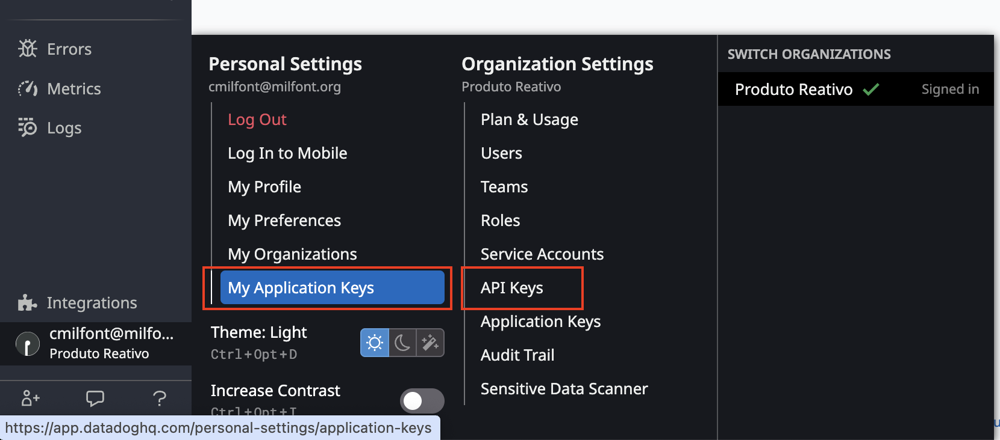

# Observabilidade (O11Y) em primeiro lugar

Se quiser acessar a documentação da aula 1, precisa ir no [README da aula](./aula-1/README.md).

Aula 2 inicia modelagem com DataDog, siga os passos seguintes para validar a estrutura.

## DataDog

Precisa gerar uma API Key e uma Application Key em dois menus diferentes que encontra a partir do icone do usuário no canto inferior esquerdo em:



## Terraform

Estrutura inicial para criação dos nossos artefatos de Infra as a Code utilizando o Terraform para gerar toda a observabilidade do plano de Confiabilidade.

Antes de executar, crie um arquivo em /aula-2/setup/magasiara/terraform/terraform.tfvars

Com o conteúdo:
```sh
datadog_api_key = "xxxxxxxxxxxxxxxxxxxxxxxxxxxxxx"
datadog_app_key = "xxxxxxxxxxxxxxxxxxxxxxxxxxxxxx"
datadog_site    = "datadoghq.com"
```

### Criar a Dashboard com os comandos

```sh
cd aula-2/setup/magasiara/terraform
terraform init
terraform plan
terraform apply
```

### Ingestão dos dados para testar a Dashboard com

```sh
export DD_API_KEY=xxxxxxxxxxxxxxxxxxxxxxxxxxxxxx
export DD_APP_KEY=xxxxxxxxxxxxxxxxxxxxxxxxxxxxxx

chmod +x send_group_metrics.sh
./send_group_metrics.sh
```

## Atualizando o vestigium

Crie um arquivo .env dentro da pasta aula-2/vestigium com o conteúdo:
```sh
DD_API_KEY=[SUA DD_API_KEY]

DD_AGENT_HOST=localhost
DD_TRACE_AGENT_PORT=8126
DD_ENV=development
DD_SERVICE=search-api
DD_VERSION=1.0.0
```

```sh
cd aula-2/vestigium
chmod +x setup.sh start-all.sh update-all.sh

./setup.sh
```

Clonar novamente com 

```sh
./setup.sh
```

No repo webshop, precisa clonar o arquivo:
```sh
cp produtos/webshop/src/store/datadog/options-example.ts produtos/webshop/src/store/datadog/options.ts
```

Colocar as credenciais do DataDog e executar com:

```sh
./start-all.sh
```

## Criar uma massa de dados

Exercicio de casa criar um setup de testes de integração que cria produtos no Magento.  
Observa as credenciais de acesso no [docker compose](./aula-2/setup/magasiara/docker-compose.yml) para acessar os recursos de Magento, Elasticsearch, etc.

Crie um arquivo .env dentro da pasta aula-2/setup/magasiara com o conteúdo:
```sh
DD_API_KEY=xxxxxxxxxxxxxxxxxxxxxxxxxxxxxx
DD_APP_KEY=xxxxxxxxxxxxxxxxxxxxxxxxxxxxxx
```

Executa o terraform
```sh
docker compose up -d
```

Depois de criar alguns produtos, manualmente ou automaticamente, acessa em:
```sh
http://localhost:5173/
```

## Repositórios utilizados

Agregador de Confiabilidade:  
https://github.com/produtoreativo/webshop 

Repositórios dos serviços:  
https://github.com/produtoreativo/webshop  
https://github.com/produtoreativo/webshop-api  
https://github.com/produtoreativo/search-api  
https://github.com/produtoreativo/order-mngt-api  
